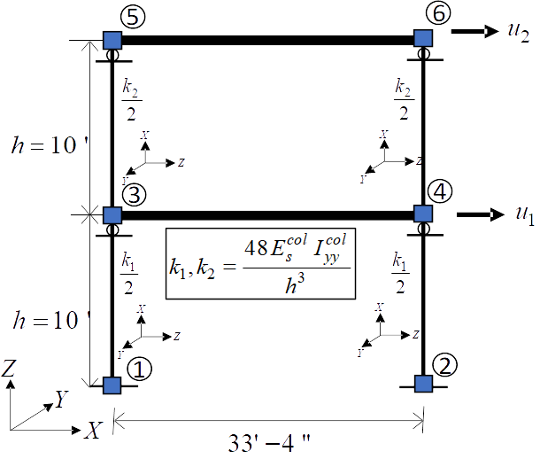
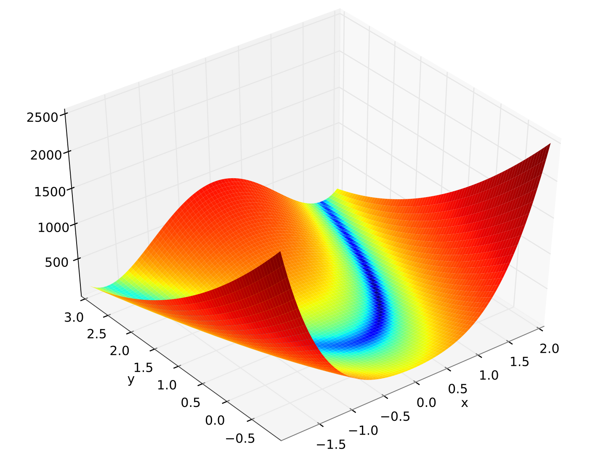

---
title: Examples
full_width: true
no_toc: true
...

# Examples

<h5 class="card-title">2D Frame</h5>
<ul>
<li><code>quoFEM</code>:Forward Propagation</li>
<li><code>quoFEM</code>: Reliability Analysis</li>
<li>...</li>
</ul>
<footer>
<a href="#" class="btn btn-primary">Go somewhere</a>
</footer>

<h5 class="card-title">2D Truss</h5>
<footer>
<a href="#" class="btn btn-primary">Go somewhere</a>
</footer>

<h5 class="card-title">Rosenbrock Function</h5>
<footer>
<a href="#" class="btn btn-primary">Go somewhere</a>
</footer>

